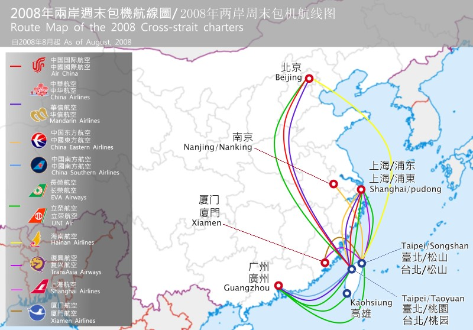
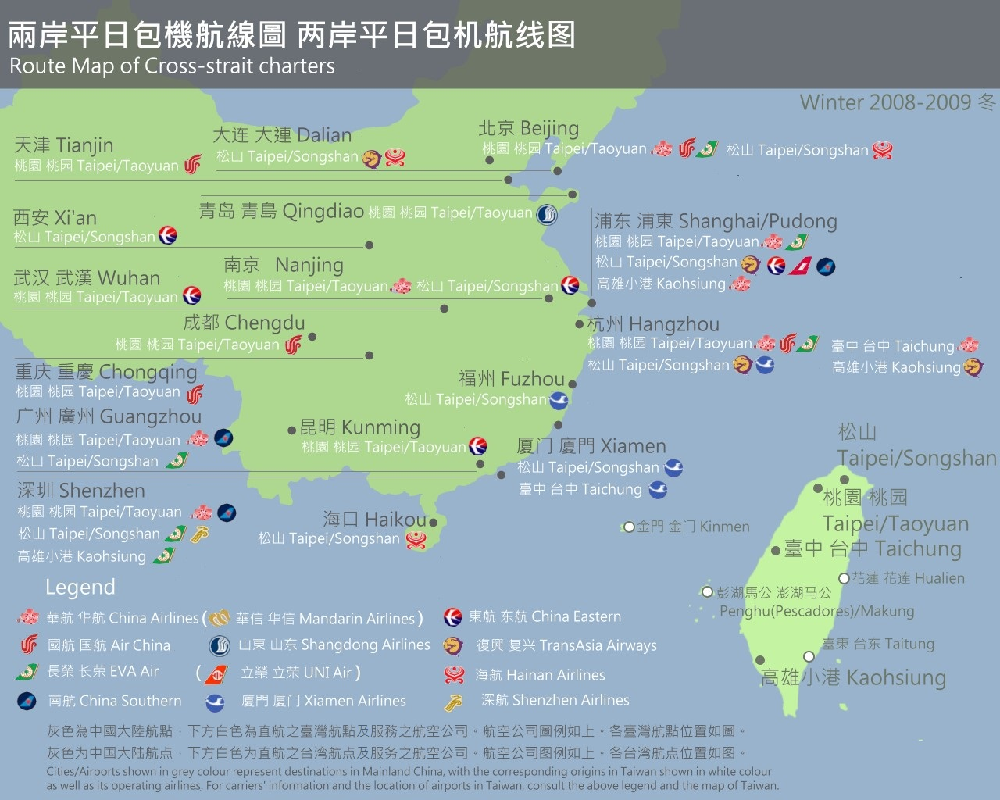

```{r setup, include=FALSE}
knitr::opts_chunk$set("eval"=T,message=FALSE, warning=FALSE,comment="") # set global: overide indi. chunks source("./china/plot_2008_10.R",encoding="utf-8")
library(flexdashboard)
```

```{r, echo=FALSE, message=FALSE, warning=FALSE}
source("./unemployment.disease/tmap.R")
```

```{r, echo=FALSE, message=FALSE, warning=FALSE}
source("./china/plot_2008_10.R",encoding="utf-8")
source("./china/plot_table.R",encoding="utf-8")
source("./china/plot_yearly.R",encoding="utf-8")
source("./unemployment.disease/plot_unemployment.R",encoding="utf-8")
source("./unemployment.disease/plot_SARS.R",encoding="utf-8")
source("./unemployment.disease/plot_h1n1.R",encoding="utf-8")
source("./unemployment.disease/plot_2015KoreaMERS.R",encoding="utf-8")
source("./currency/plot_curr.R",encoding="utf-8")
source("./currency/plot_visa.R",encoding="utf-8")
source("./korea/plot_kor.R",encoding="utf-8")
```

Ranking {data-navmenu="概觀" data-commentary-width=23 data-icon="glyphicon glyphicon-signal"}
=========================================

row1 {.tabset}
--------------------

### 旅遊目的地排名變化
```{r echo=FALSE}
ggplotly(pl_year_country)
```

### 排名表
```{r echo=FALSE}
table()
```

### 2008 東亞
```{r echo=FALSE}
ggplotly(pl_2008_ea)
```

### 2009 東亞
```{r echo=FALSE}
ggplotly(pl_2009_ea)
```

### 2010 東亞
```{r echo=FALSE}
ggplotly(pl_2010_ea)
```

### 2008-10 東亞
```{r echo=FALSE}
ggplotly(pl_2008_10_ea)
```

### 2012-17 前十
```{r echo=FALSE}
ggplotly(pl_2012_17_all)
```


Ranking {.sidebar}
-------------------------------------

<br>

#### 排名前十

* 東亞 (中港澳日韓)

* 東南亞 (泰越新馬印尼)

* 美國

<br>

#### 觀察

    
* 近年 vs. 20年前：**異軍突起**
    
* 中國大陸：2008之後暴增
    
* 韓國：2003之後


<br><br><br>

<div class="absolute">
註：可將位於圖右側之legend上的國家按掉，再到圖上側按Autoscale，y軸就會調整到最適宜尺度。
</div>


Explore {.storyboard data-navmenu="概觀" data-commentary-width=23 data-icon="ion-ios-search-strong"}
=========================================

### 究竟旅遊人數和什麼有關？

```{r, echo=FALSE, message=FALSE, warning=FALSE}
World_2015_c
```

***

<br>

#### **臺灣出國旅遊目的地**

##### [點此](#dest-map)檢視2010-2015臺灣出國旅遊目的地的互動式地圖

### 旅遊要資金，**失業率**會影響？

```{r echo=FALSE, message=FALSE, warning=FALSE}
pl_unem
```

### ...那麼**匯率**呢？

```{r echo=FALSE, message=FALSE, warning=FALSE}
pl_curr
```

***

<br>

##### [點此](#cost)看我們針對韓國的研究

<div class="absolute">
註：該圖時間軸可拖拉縮放
</div>

### 旅遊要平安，**疾病**會影響？ 看看SARS的威力

```{r echo=FALSE, message=FALSE, warning=FALSE}
pl_depart_2003
```

***

<br>

##### [點此](#sars)或上方**疾病**，看我們針對疾病的研究

### 兩岸的恩怨情仇？！ 看看**政治**的影響力

```{r echo=FALSE, message=FALSE, warning=FALSE}
ggplotly(pl_2008_17_ch)
```

***

<br>

##### [點此](#flight)或上方**中國**，看我們針對中國大陸的研究

### 年齡層與性別：**韓流**的魅力？

```{r echo=FALSE, message=FALSE, warning=FALSE}
pl_kor_gender_tour
```

***

<br>

##### [點此](#korean-wave)或上方**韓國**，看我們針對韓國的研究


Dest. Map {data-navmenu="概觀" data-icon="glyphicon glyphicon-globe"}
======================================

Title {data-height=31}
------------------
#### **國人旅遊目的地**

臺灣出國旅遊目的地：人數 {.tabset}
------------------

### 2015

```{r, echo=FALSE, message=FALSE, warning=FALSE}
World_2015
```

### 2014

```{r, echo=FALSE, message=FALSE, warning=FALSE}
World_2014
```

### 2013

```{r, echo=FALSE, message=FALSE, warning=FALSE}
World_2013
```

### 2012

```{r, echo=FALSE, message=FALSE, warning=FALSE}
World_2012
```

### 2011

```{r, echo=FALSE, message=FALSE, warning=FALSE}
World_2011
```

### 2010

```{r, echo=FALSE, message=FALSE, warning=FALSE}
World_2010
```


SARS {data-navmenu="疾病" data-icon="fa-stethoscope"}
===========================================

Row {.tabset}
----------------------------

### 旅遊人數

```{r echo=FALSE}
ggplotly(pl_tour_year)
```
> 2003：旅遊人數大暴跌

### 2003 桃機出境人數

```{r echo=FALSE}
pl_depart_2003
```

SARS對臺灣出國旅遊 {.sidebar}
-------------------------------------

<br>

#### **旅遊人數**

* 2003年臺灣出國旅遊人數明顯下降

* 同年，SARS疫情也在中國、臺灣爆發

<br>

#### **2003桃機出境人數**

* SARS的疫情(綠)與出境人數(紅)有明顯負向關聯

* 此關聯與季節性出境人數之週期無關(紫線，2002出境人數)


MERS {data-navmenu="疾病" data-icon="fa-user-md"}
=================================

row 1
--------------------------

###
```{r echo=FALSE}
pl_MERS_tour
```

row 2
--------------------------

###
```{r}
pl_MERS_case
```

sidebar {.sidebar}
--------------------------

<br>

**MERS**

* 主要流行於**中東地區**

* 致死率比SARS高

* 亞洲僅**韓國大規模**爆發

<br>

**韓國**

* 2015/06 疫情最為嚴重

* 台灣前往韓國旅遊人數下降

* 日本：未傳出疫情

H1N1 {data-navmenu="疾病" data-icon="fa-plus-square"}
===========================================

row1 {.tabset}
--------------------

### Japan H1N1
```{r echo=FALSE}
pl_h1n1_jp_09_10
```

### Korea H1N1
```{r echo=FALSE}
pl_h1n1_kr_09_10
```

row2 {.tabset}
-------------------

### Jp: 2011-2012
```{r echo=FALSE}
pl_h1n1_jp_11_12
```

### Kor: 2011-2012
```{r echo=FALSE}
pl_h1n1_kr_11_12
```

### Jp: 2008
```{r echo=FALSE}
pl_h1n1_jp_07_08
```

### Kor: 2008
```{r echo=FALSE}
pl_h1n1_kr_07_08
```


H1N1 {.sidebar}
-------------------------------------

<br>

Upper Row: **H1N1大流行**

* 日本、韓國: 2009-10 H1N1大流行

* H1N1疫情與旅遊人數**似乎有負向關聯**

<br>

Lower Row: **沒有H1N1影響**

* 旅遊人數波動與2009-10**類似**

* H1N1疫情**無法解釋**旅遊人數的改變

<br>

**推測原因**

* H1N1最嚴重時(9月至隔年1月)與旅遊淡季重疊

* H1N1致死率相對SARS或MERS低許多

    * 未造成恐慌

<div class="absolute">
註：可拖拉調整時間軸尺度
</div>

Flight {data-navmenu="中國" data-icon="fa-plane"}
===========================================

row 1 {.tabset data-height=660}
--------------------

### 2008-10東亞
```{r echo=FALSE}
ggplotly(pl_2008_10_ea)
```

### 問題與假設

<div class="padding">

#### **Q：為什麼增加了這麼多人去中國大陸？**

究竟他們去那邊...？

<br>

#### **假設：**

> 1. 台商**不透過香港**直接進中國大陸

> 2. **成本下降**，台商**更頻繁前往**中國大陸

> 3. 更**方便**，前往中國大陸**旅遊人數增加**

> 4. 政策及社會氛圍，兩岸**往來更加頻繁**

</div>


### 週末包機



### 平日包機



### 載客率


### 載客率_2


row 2 {data-height=340}
------------------------

### 
```{r echo=FALSE}
timevis(flight_ch)
```


sidebar {.sidebar}
-----------------------

<br>

**2008-10：中國**


* 中國：於**2008/12 - 2009/02**成長驚人

* 受**春節**影響

* 2008年12月：**兩岸平日包機**

* 前往中國大陸人數：較前一年同期大幅成長

    
<br><br>

**兩岸直航大事紀**

```{r echo=FALSE}
kable(flight_tb,format ='markdown',align='c')
```

Compare {data-navmenu="中國" data-icon="ion-android-globe"}
===========================================

row 1 {.tabset}
---------------------------
### 2008-2017 China
```{r echo=FALSE}
ggplotly(pl_2008_17_ch)
```

### 1997-2016 China vs. Japan
```{r echo=FALSE}
ggplotly(pl_year_jp_ch)
```

### 2012-2017 排名
```{r echo=FALSE}
ggplotly(pl_2012_17_all)
```

Korean Wave {data-navmenu="韓國" data-icon="fa-television" data-orientation=columns}
===========================================

column 1 {.tabset}
--------------------

### 韓國:年齡
```{r}
pl_kor_age_tour
```

### 韓國:性別
```{r}
pl_kor_gender_tour
```

column 2 {.tabset}
--------------------

### 日本:年齡
```{r}
pl_jp_age_tour
```

### 日本:性別
```{r}
pl_jp_gender_tour
```

sidebar {.sidebar data-width=240}
---------------------------

<br>

**日本**

年齡、性別：**各族群趨勢一致**(線條平行)

推論：
    
* 對日本偏好**無特定族群差異**

<br>

**韓國**

性別：2001年，女性旅遊人數超越男性

年齡：2000-03年，**20-29歲**(青綠色)與其他年齡層**趨勢迥異**

韓流起始：2000年？

* 韓劇**火花**、**藍色生死戀**開播
    
* 自此之後，女性旅客皆比男性多，且**差距不斷地升高**

<div class="absolute">
註:可拖拉橫移時間軸，比較2001年附近日韓的差別
</div>
    

Cost {data-navmenu="韓國" data-icon="fa-usd" data-orientation=columns}
===========================================

column 1 {.tabset data-width=450}
--------------------

### 日本:按年齡
```{r echo=FALSE, message=FALSE, warning=FALSE}
pl_jp_age_tour
```

### 韓國:按年齡
```{r echo=FALSE, message=FALSE, warning=FALSE}
pl_kor_age_tour
```

### 總人數
```{r echo=FALSE, message=FALSE, warning=FALSE}
pl_total
```

column 2 {.tabset data-width=550}
--------------------

### 匯率
```{r echo=FALSE}
pl_curr
```


簽證 {data-orientation=rows}
===========================================

row1 {data-height=680}
---------------------

###
```{r echo=FALSE}
ggplotly(pl_visa_country)
```

row2 {data-height=320}
--------------------

###
```{r echo=FALSE}
timevis(visa)
```


